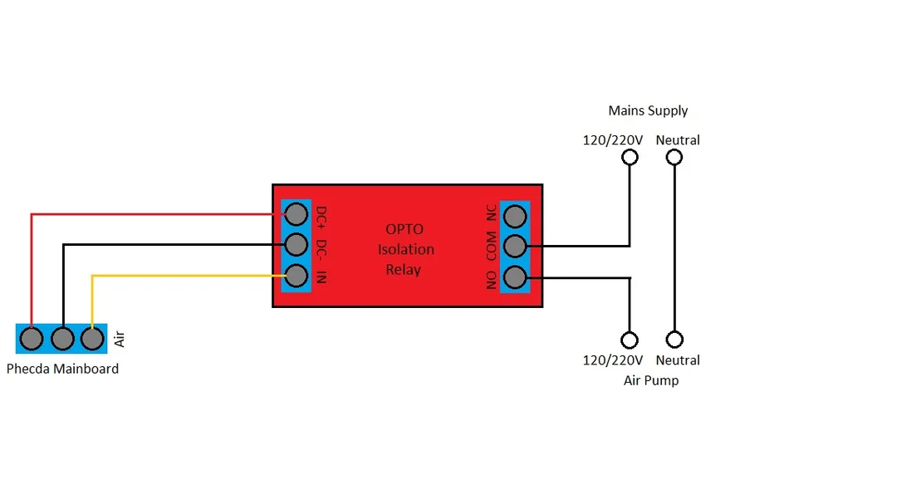

# Automatic Air Assist

r/ELEGOOPHECDA

October 9, 2023

JouleNewton u/JouleNewton

---

You can make your air assist automatic using Lightburn (using the air assist toggle in the layers panel).

Connect USB to your machine and open the console tab in Lightburn. If you are connected correctly you should enter $44 and get a value of 1 or (in my case) a 0. Turn on air assist by entering $44=1. This activates the Air output pins on the machine's control board. You have to change the air assist command to M7 (default is M8) in lightburn under Device settings. Now you'll want one of these (or similar) relay boards: https://www.amazon.com/dp/B00LW15A4W

In the pics I'm using breadboard jumpers to test but you would want to find the correct 3 pin connector. Here they are https://www.amazon.com/2-54MM-Female-Single-Connector-Wires/dp/B07FBHKY8G/ref=sr_1_16 The connector on the Elegoo board is labeled Air. With the same orientation as in the picture, connect pin 1 (left) to DC+ on relay board, pin 2 (middle) to DC-, and pin 3 (right) to In.

If you did everything correct, your board should have a green light and you should be able to enter M7 in the lightburn console tab and your relay board will trigger (Red LED). M9 turns it off. If it's backwards you need to move the jumper over on the board.

If you bought the Air assist pump from Elegoo you would have to wire in the high voltage to the board (NO,C) so do so at your own risk otherwise you can buy a low voltage pump or use an air solenoid if you have an air compressor. I am going to use one of these [https://www.amazon.com/Piggyback-Switch-Humidistat-Heater-Control/dp/B07CMP9F95/ref=sr_1_3](https://www.amazon.com/Piggyback-Switch-Humidistat-Heater-Control/dp/B07CMP9F95/ref=sr_1_3) with the Elegoo pump and then run the pigtail into a plastic box with the relay board.

Edit: Got all my parts in so now have a permanent setup 😁

Here's a simple wiring diagram. If you're using the same power supply pigtail make sure you use brown & green to the relay board.
