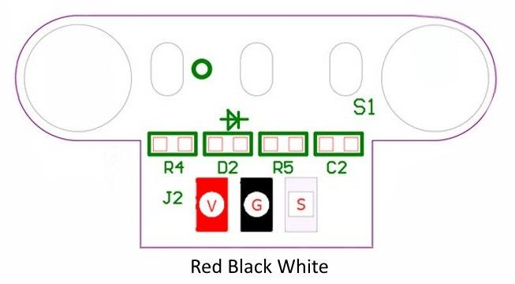
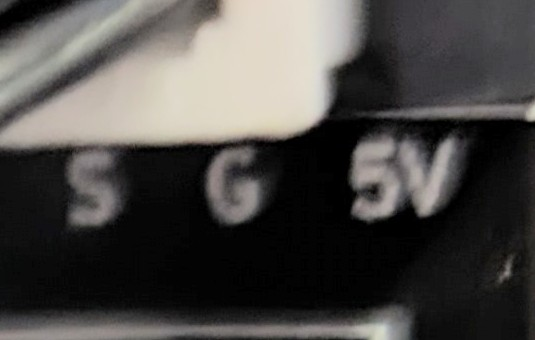

# Limit Switches

The original source for this install was from [Max the Silent One on Discord](https://discord.com/channels/969282195552346202/1072919846850932756/1163711218494746735) who reposted from Cobey Schmidt on Facebook.  I found the setup from this set of brackets and switches was painfully easy.  But I found key differences from the directions and actual install.  While the directions would have worked they limit the full functionality of the suggested switches.  Specifically the LEDs.  Everyone knows things will run better with LEDs.  Would run faster with RGB LEDs.

## Materials

- [Switches](https://www.amazon.com/dp/B07PCN6T6F/ref=cm_sw_r_as_gl_apa_gl_i_WW6GRJDX7JXWW3QNT4D0?linkCode=ml1&tag=geeksatlarge-20)
- Print X & Y Brackets
- 1 x M3x12mm Screw for X bracket
- 2 x M4x10mm Screws for Y bracket

## Modify cabling

I found that the included cables were not long enough for the X axis so I had to splice 2 wires.

Key differences between the suggested switches and the controller board.

- Switch: 5v - Grnd - Signal

  

- PHECDA: Signal - Grnd - 5v

  

The initial directions suggested moving the wire and only using 2 wires.  This will break the LED functionality.  Instead I just swapped the order of the wires and later configured LightBurn to accept that the switches were inverted.  Instead of signal to ground I believe that means it is signal to 5v.  Or instead of NO to CLOSED I opted for NC to OPEN.

## Config Settings to Remember

- Hard Limits = TRUE
- Homing Cycle = TRUE
- Y Homing Direction Invert = TRUE
- Limit Pins Invert = ?